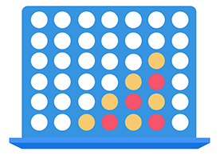

# CONNECT 4

## GAME DESCRIPTION

*Connect 4* is a game of concentration and skill very well known and practiced by adults and children.

### PLAYERS

It is played one on one for a maximum total of two players.

### CHESSBOARD

The game board is composed of a plastic structure, most of the times of blue color, easy to disassemble and assemble inside which, thanks to the presence of vertical guides, the checkers slide until depositing on each other. The checkers are instead of hard plastic and two different colors, yellow and red for a total of twenty-one elements. Shape and weight are practical, there are however table versions and travel versions with smaller dimensions.

### RULES

Players decide via counts which of the two will start the game(in the case of our program will start the player 1). In turn they will then slide their checker in the tracks from the board trying to align four checkers in a horizontal row, vertical or oblique. In the meantime, they have to be careful of the opponent’s moves to avoid that he can also make four stacking his own. It is very important to stay focused and study your opponent’s moves. In case neither of the two participants in the game managed to make "four" the game ends in a draw and another one starts.

### RATING

The winner is the player who first aligns four pieces of the same colour horizontally, vertically or obliquely.

### PURPOSE

The aim of the game is to be able to align four pieces of the same color in the game board either vertically, horizontally or obliquely.
For more information about the board game click [here](https://www.gamesver.com/the-rules-of-connect-4-according-to-m-bradley-hasbro/)

## PROGRAM DESCRIPTION

### EXECUTION OF THE PROGRAM

Before running the program make sure that:

- the jar file and the text file *"Connect4SaveFile.txt"* are placed in the same folder or location.

- you have the *java openjdk*, make sure that the latter is installed in the latest versions, otherwise it may cause errors while running the program.

- the Connect4.png (frame icon) image is in the same directory as the jar file

To run the program there are two ways:

- by clicking on the jar file
- alternatively if you are on:
  - **LINUX:** opening the terminal and typing: `java -jar path to jarfile.jar`
  - **WINDOWS:** opening the cmd and typing: `java –jar c: path to jar`
  - **MAC:** opening the terminal and typing: `java -jar path to jar file.jar`

### START THE GAME

 
 
Once the program runs you will start the initial game screen, where you have the option to enter the names of the two players, view the color of your checker, view the game instructions, once you have done that you must remember to save, using the *"save"* button to keep the names entered. 
It is also possible to reload a previously saved game, in case of failure to save will open an error window.
Once all this is done you can start the game via the *"start"* button.

### WITHIN THE GAME

 

Once you click on Start you will open another window where there is the blue game *"chessboard"* with all white circles, depending on the button you click *(present at the bottom and ranging from 1 to 7)*, will be colored a circle according to the color of the player, starting from the first row at the bottom upwards.In addition to this is the "pause" button, if you click on the latter, it will open another window where you can: *"save", "save and exit", "exit ".*

### PROJECT STATUS

The project is finished but is always open for changes.

## AUTHORS

*MATTIA DI MARCO, GERMANO ANSELMI*

